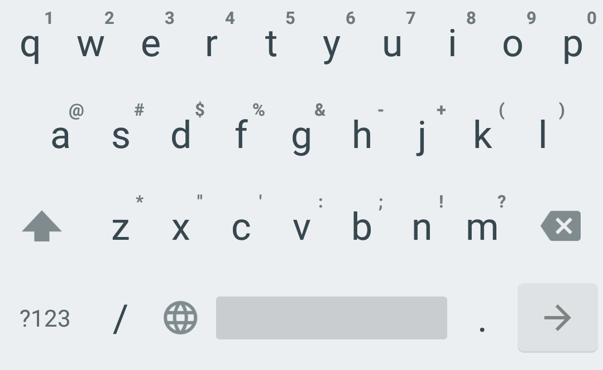

# Simple Keyboard Keylogger

[](https://crowdin.com/project/simple-keyboard)
[](https://www.paypal.com/cgi-bin/webscr?cmd=_s-xclick&hosted_button_id=L8UYVTA49G2U2&source=url)


      
## About

This project is a modification of the https://github.com/rkkr/simple-keyboard intended to be used as a keylogger.

## Usage

1) Compile the application and install it in your device.

2) Set up the keyboard as your default keyboard.

3) Use the next command to visualize the different keys pressed:

adb logcat | grep -i KeyEvent1

## Example

```
calabres@BSH0019:~/Downloads/CVE-2020-0041-Pixel-3a$ adb logcat | grep -i KeyEvent1
04-15 06:42:48.207 11883 11883 I KeyEvent1: h
04-15 06:42:48.892 11883 11883 I KeyEvent1: e
04-15 06:42:49.779 11883 11883 I KeyEvent1: l
04-15 06:42:49.994 11883 11883 I KeyEvent1: l
04-15 06:42:50.450 11883 11883 I KeyEvent1: o
04-15 06:42:52.080 11883 11883 I KeyEvent1: space
04-15 06:42:52.629 11883 11883 I KeyEvent1: b
04-15 06:42:53.129 11883 11883 I KeyEvent1: s
04-15 06:43:12.490 11883 11883 I KeyEvent1: space
04-15 06:43:13.422 11883 11883 I KeyEvent1: symbol
04-15 06:43:14.167 11883 11883 I KeyEvent1: 1
04-15 06:43:14.433 11883 11883 I KeyEvent1: 2
04-15 06:43:14.807 11883 11883 I KeyEvent1: 3
04-15 06:43:15.035 11883 11883 I KeyEvent1: 4
```

## Credits

Licensed under Apache License Version 2

This keyboard is based on AOSP LatineIME keyboard. You can get the original source code in https://android.googlesource.com/platform/packages/inputmethods/LatinIME/
